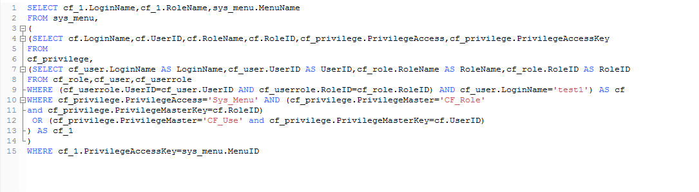
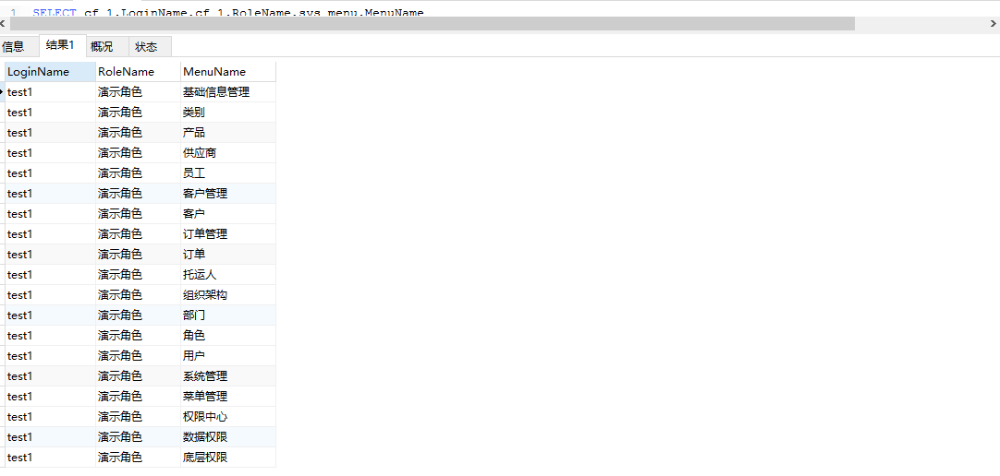
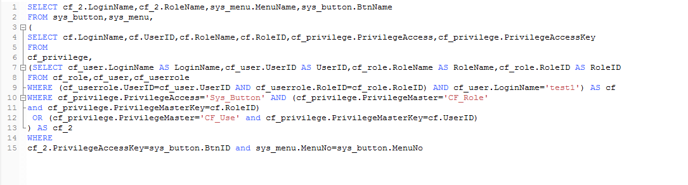
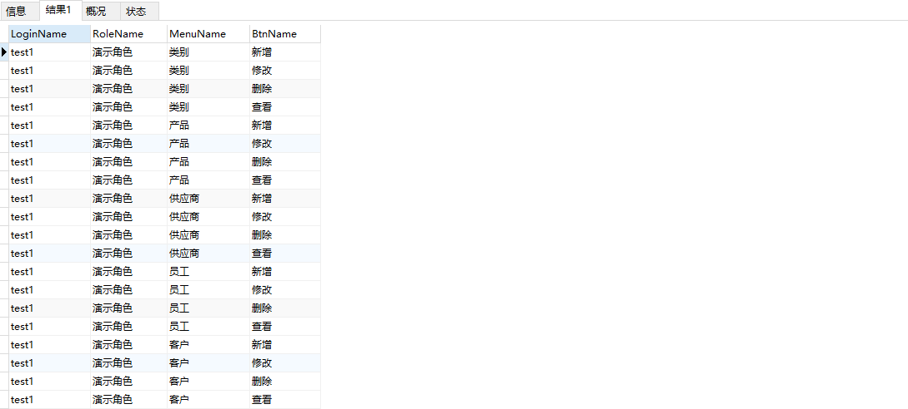

###查询语句1
SELECT cf_1.LoginName,cf_1.RoleName,sys_menu.MenuName
FROM sys_menu,
(
(SELECT cf.LoginName,cf.UserID,cf.RoleName,cf.RoleID,cf_privilege.PrivilegeAccess,cf_privilege.PrivilegeAccessKey
FROM
cf_privilege,
(SELECT cf_user.LoginName AS LoginName,cf_user.UserID AS UserID,cf_role.RoleName AS RoleName,cf_role.RoleID AS RoleID 
FROM cf_role,cf_user,cf_userrole 
WHERE (cf_userrole.UserID=cf_user.UserID AND cf_userrole.RoleID=cf_role.RoleID) AND cf_user.LoginName='test1') AS cf
WHERE cf_privilege.PrivilegeAccess='Sys_Menu' AND (cf_privilege.PrivilegeMaster='CF_Role' 
and cf_privilege.PrivilegeMasterKey=cf.RoleID)
 OR (cf_privilege.PrivilegeMaster='CF_Use' and cf_privilege.PrivilegeMasterKey=cf.UserID)
) AS cf_1
)
WHERE cf_1.PrivilegeAccessKey=sys_menu.MenuID

###查询语句2
SELECT cf_2.LoginName,cf_2.RoleName,sys_menu.MenuName,sys_button.BtnName
FROM sys_button,sys_menu,
(
SELECT cf.LoginName,cf.UserID,cf.RoleName,cf.RoleID,cf_privilege.PrivilegeAccess,cf_privilege.PrivilegeAccessKey
FROM
cf_privilege,
(SELECT cf_user.LoginName AS LoginName,cf_user.UserID AS UserID,cf_role.RoleName AS RoleName,cf_role.RoleID AS RoleID 
FROM cf_role,cf_user,cf_userrole 
WHERE (cf_userrole.UserID=cf_user.UserID AND cf_userrole.RoleID=cf_role.RoleID) AND cf_user.LoginName='test1') AS cf
WHERE cf_privilege.PrivilegeAccess='Sys_Button' AND (cf_privilege.PrivilegeMaster='CF_Role' 
and cf_privilege.PrivilegeMasterKey=cf.RoleID)
 OR (cf_privilege.PrivilegeMaster='CF_Use' and cf_privilege.PrivilegeMasterKey=cf.UserID)
) AS cf_2
WHERE
cf_2.PrivilegeAccessKey=sys_button.BtnID and sys_menu.MenuNo=sys_button.MenuNo

